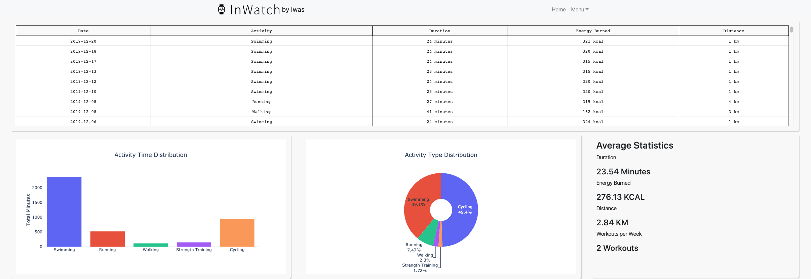

## View App: http://inwatch.herokuapp.com/ 

InWatch is a web application that transforms raw apple watch sensor-data to an interactive multi-page dashboard with visualizations (time series, distributions etc.) insightful statistics and creates tools to utilize the measured data (e.g. smart diet tracker).

Used Technologies/Stack: Flask, Dash by Plotly, SQLAlchemy(SQLite), Pandas, Numpy, Plotly, Bootstrap, HTML, CSS, Heroku 

### App Structure

Frameworks: [Flask](https://www.palletsprojects.com/p/flask/), [Dash by Plotly](https://plot.ly/dash/)

Database: [SQLite (Flask SQLAlchemy)](https://flask-sqlalchemy.palletsprojects.com/en/2.x/)

Deployment: [Heroku](https://heroku.com/)

Important Libraries: [Pandas](https://pandas.pydata.org/), [Numpy](https://numpy.org/), [Dash Bootstrap Components](https://dash-bootstrap-components.opensource.faculty.ai/), [Plotly](https://plot.ly/python/)

### Content

**Basic Page**: Interactive Time Sereies Visualizations (Burned Calories, Step Count, Standing Time, Exercise Time) with option to show last 7 days, last 30 days, months of the year and total years 

**Workout Page**: Scrollable Data-Table with Historic Workouts, Activity Time Distribution Plot, Activity Time Distribution Plot and Average Activity Statistics). Want to take a picture of a graph? - just hover over the graph and save it as png! 

**Smart Diet Page**: Smart Diet that visualizes weight and bmi over time. Every time the weight is upgraded the new weight will be added to the SQLite database and at the same time the visualizations and statistics are upgraded. I also implented a tool to be able to set a weight-goal and goal-date, which utilizes sensor-data of burned energy to accurately calculate how many calories need to be consumed in order to succesfully reach the weight-goal in time for the date-goal!

Next Steps:

- Implement Upload Component to let Users upload their own personal data to be able to receive their own personal Dashboards
